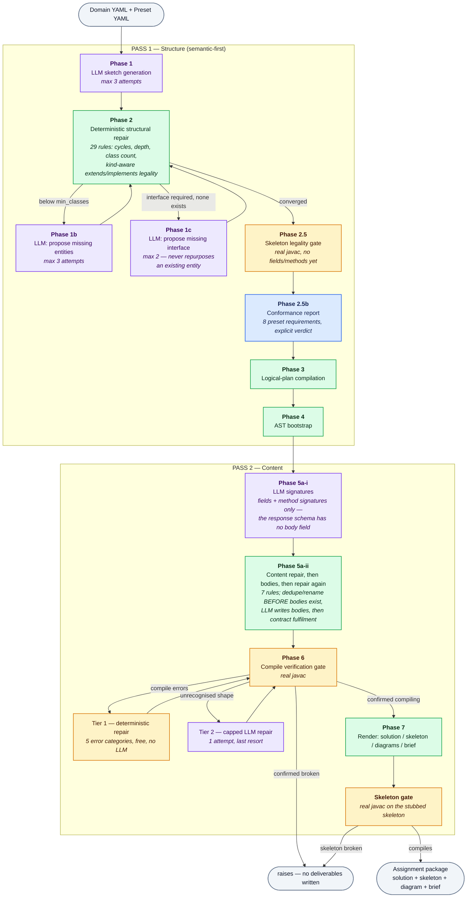

# OOP Assignment Generator

### Semantic-First, Deterministic-Repair Pipeline for Auto-Generating Java OOP Assignments

<p>
  
  
  
  
  
  
  <a href="LICENSE"></a>
</p>

> Published for portfolio and academic review. Publicly viewable, not open for reuse — see [`LICENSE`](LICENSE).

Generates a complete Java OOP programming assignment — class diagram, full reference solution, student skeleton, and assignment brief — from two inputs: a **domain** (topic plus entity/relationship vocabulary) and a **blueprint preset** (difficulty: class-count range, inheritance depth, which OOP features the design should include).

Two things this README tries to do that most do not. First, every claim carries the **level of evidence behind it** — see [Epistemic Status](#-epistemic-status), which grades all 16 areas L1–L5 and marks the single one that is a completeness proof. Second, it separates *status* from *decisions*: the table below is the only place status lives, and **Open Boundaries** holds only the choices and genuinely open work, so nothing is stated twice.

Mechanism-level detail (every rule, its trigger condition, and `file:line`) is in [`docs/pipeline-audit-v4-technical-report.md`](docs/pipeline-audit-v4-technical-report.md).

---

## 🧩 Why This Architecture

One LLM call asked to produce a complete, structurally valid, pedagogically correct OOP design must satisfy two *categorically different* kinds of constraint at once:

- **Semantic** — sensible entity names; relationships that make domain sense (a `Customer` should own an `Account` more strongly than a `Bank` does).
- **Structural** — exact class-count range, no inheritance cycles, legal interface/abstract usage, valid Java visibility.

LLMs are strong at the first and unreliable at holding the second across a long generation. Forcing one call to do both produces a *systematic* failure, not a random one: the model trades correctness in one dimension for the other.

### Two architectures were considered

**Structure-first** — code generates a valid graph shape, the LLM fills in names afterwards. The risk is that the LLM *rationalises* a structure it did not choose, inventing a plausible explanation for a nonsensical relationship (`Account inherits Transaction`) instead of flagging it. That failure is dangerous precisely because it looks intentional on review.

**Semantic-first** (chosen) — the LLM designs freely from the domain; a deterministic layer repairs structural violations afterwards, and the LLM is called back only when genuinely new *content* is needed, never to "self-correct" its own structure.

**This was proven, not assumed.** A direct test forced an existing, meaningful entity — `Order`, holding `composes_with: [Product]` and `associated_with: [Payment]` — to become an interface in order to satisfy a missing-interface requirement. Interfaces cannot hold state, so the repair step correctly stripped both relationships. The result was an empty `public interface Order {}`: the one entity that carried the point of the domain, silently destroyed. It compiled cleanly, and no automated check had anything to say about it. That is the failure mode structure-first risks *by construction*, and it is why interfaces here only ever come from genuine LLM proposals and are never manufactured by repurposing an existing entity.

That example is also the reason for a specific asymmetry documented later: aggregation may be collapsed into composition, but an interface or abstract class may never be collapsed into something else.

---

## 🏗️ Architecture: 7 Phases, 2 Passes

<sub>🟣 LLM call &nbsp;&nbsp; 🟢 deterministic code, no LLM &nbsp;&nbsp; 🟠 real-`javac` gate &nbsp;&nbsp; 🔵 machine-readable verdict</sub>



The governing principle, applied at every phase: **the LLM owns meaning, deterministic code owns invariants it can verify with certainty, and the LLM is called back only when a gap requires genuinely new content — never to "please try to be more correct."**

**Why the oracle matters more than the rule count.** Phase 6 does not hand-write an ever-growing list of Python rules that each encode one more slice of the Java Language Specification. It runs the real `javac` and reacts to its actual output. Five known error shapes (missing import, private-field access from a subclass, invalid override, duplicate method, unfulfilled contract) are fixed deterministically for free; anything unrecognised escalates to a single capped LLM attempt. The same idea appears three more times — Phase 2.5, the skeleton gate, and the test suite's fuzz and legality matrix all use `javac` as the arbiter rather than a Python restatement of what we believe `javac` requires.

**Cost.** A clean run makes **4 LLM calls** (sketch, design decisions, signatures, bodies) — measured, not estimated. The ceiling is **13**, reached only if every retry and fallback fires: sketch ≤3, missing entities ≤3, missing interface ≤2, plus design decisions, signatures, bodies, contract fill, and one Tier 2 attempt.

---

## ✅ Epistemic Status

Every claim sits on one of five levels. **The level matters more than the claim** — it answers *how do you know*, not *does it work*.

| Level | Backing | What it licenses |
|---|---|---|
| **L1** — oracle exhaustion | Every point of a **bounded** space enumerated, each label decided by a real oracle (`javac`), locked as a regression test | A genuine **completeness** claim. "Why this rule?" → an exit code |
| **L2** — spec derivation | Rule derived from the JLS or a type constraint, not from the bug that surfaced it | Correctness of that rule. Says nothing about the rule *set* being closed |
| **L3** — measurement, threshold pre-registered | Live trials, decision threshold fixed *before* running anything | A calibrated decision, valid **only inside the measured envelope** |
| **L4** — oracle sampling | Fuzz or unit trials against real inputs | "We found bugs and closed them." **Not** "the rule set is closed" |
| **L5** — read-through | Manual reasoning, no oracle wired | Nothing verifiable. Labelled as such, never folded upward |

**L1 answers "why exactly these N rules and not N+1". L4 cannot.** Most of this system is L4, stated plainly rather than blurred: a rule set with no closure argument is one bug report away from becoming an ad-hoc patch pile, and knowing which areas are in that state is the entire point of the table.

### Area by area

| # | Area | Level | Status |
|---|---|---|---|
| 1 | `extends`/`implements` kind legality — 18 cells, (class\|abstract\|interface)² × 2 verbs | **L1** | ✅ **Proven.** The only completeness proof here. Bounded space fully enumerated, every label *derived* by real `javac` rather than hand-written, locked in `test_skeleton_gate.py` |
| 2 | Reference solution compiles | **L1** | ✅ **Per run.** Phase 6 plus a fail-closed `raise`. Verification of one output — not completeness of the rules that produced it |
| 3 | Student skeleton compiles | **L1** | ✅ **Per run.** Held to the same oracle as the solution via `compile_sources()`; a confirmed failure deletes the skeleton output and raises. Was previously never checked at all |
| 4 | Config-set internal coherence | **L1 + L2** | ✅ **Enforced, not documented.** `test_config_convention.py` locks four conventions and runs the *hint graph* of all 15 combinations through Phase 2 into real `javac`. Non-vacuous: re-introducing the original aggregation bug fails exactly 2 checks |
| 5 | Declared input space — 5 domains × 3 presets = 15 | **L2** | ✅ **Closed by declaration** (`src/supported.py`), machine-checked against disk so it cannot drift. The move that makes any preset-boundary claim finite at all |
| 6 | Domain hint envelope (`MAX_ENTITY_HINTS = 8`) | **L3** | ✅ **Inside the measured envelope only** (ratio ≤ 2.0, 2 × 30 live trials); the validator refuses anything outside it instead of extrapolating |
| 7 | Java identifier safety on all generated names | **L2** | 🟡 Complete over "is a legal Java identifier". Reserved keywords deliberately excluded — renaming those is rule `4.6`'s job |
| 8 | Inheritance depth (`2.3`) and class-count bounds (`2.5`) | **L2 + L4** | 🟡 Hard-enforced and regression-tested, and both now fire under fuzz. No bounded-space argument exists for either |
| 9 | Phase 2 output under fuzz | **L4** | 🟡 **L4 forever** — sampling an infinite graph space is L4 at trial 50 and at trial 500,000. But against the real oracle, with a *measured* number: `test_repair_fuzz_javac.py` runs 120 graphs across 5 configurations into real `javac` and a probe confirms **24 of 29 rule IDs** actually fire. Never firing: `2.1d`, both `2.14` sweeps, two `2.10c` branches |
| 10 | Structural repair rule set as a whole — **29 rule IDs**, `2.0`→`2.16` | **L4** | ❌ No completeness claim exists for cycles / depth / count / kind-consistency / has-a-on-interface / dedupe *as a set*. 35 unit tests plus the fuzz above |
| 11 | Content repair rule set — **7 rule IDs**, `4.0a`→`4.8` | **L4** | ❌ No bounded space claimed. 21 unit tests, including a regression for each of the 5 live-found bugs |
| 12 | Tier-1 error-category vocabulary — **5 sets** (`TIER1_KINDS`) | **L4** | ❌ **Not provable** — `javac`'s message space is not ours to bound. What is finite is *observation*: any block matching none of the 5 is recorded on `novel_error_shapes`, logged as `NOVEL javac shape`, and appended to `novel_shapes_log.jsonl`, so "no novel shape seen" is falsifiable rather than assumed. Baseline stands at **0 across 2 live runs** |
| 13 | Preset OOP feature presence | **L2** | 🟡 **Detection complete over the preset schema, repair not attempted.** No guarantee loop for `abstraction`/`composition`; `interface` retries twice then gives up. All 8 requirements get an explicit verdict in `conformance_report.json`, and `run_all.py` exits non-zero on a violation |
| 14 | Mermaid / Markdown rendering | **L5** | ❌ Read-through of every branch against the `classDiagram` grammar; no bug found, nothing proven. An oracle **is** available (`node v24.18.0` is installed, so `mmdc` would parse-verify the `.mmd` as `javac` verifies the `.java`) — the blocker is an unmade install decision, not an absent tool |
| 15 | Behavioural correctness of method bodies | — | ❌ Not verified, **deliberately** — human-owned by design. The loop has no seam yet; see Open Boundaries #2 |
| 16 | Cost per run | — | 🟡 4 calls measured on a clean run, ceiling 13 by construction. Not instrumented, so this is two observed runs rather than a distribution |

### What completeness is even *available* here

L1 needs a **bounded** space to exhaust. That is a precondition, not a standard to aspire to — it is either present for an area or it is not. Exactly **three** bounded spaces exist in this system:

1. **Kind × verb legality** — `{class, abstract, interface}² × {extends, implements}` = 18 cells (row 1).
2. **The declared input space** — 5 domains × 3 presets = 15 combinations, closed by declaration (rows 4, 5).
3. **The preset requirement list** — a fixed schema of 8 checks, so *detecting* a violation is complete even though *repairing* one is not (row 13).

Everything else is unbounded **by construction**: `javac`'s message space is not ours to define, the space of all sketch graphs is infinite, and the space of all English behavioural specifications is infinite. For those areas L1 is **unavailable**, not merely unachieved — and no amount of extra fuzzing changes it, because sampling an infinite space is still L4 at trial 380 and at trial 380,000.

So the honest response to an unbounded area is not more effort in the same direction. It is three finite moves:

- **Declare the supported subset**, so the remaining claims are scoped to something enumerable (row 5).
- **Make observation finite and falsifiable.** You cannot prove `javac`'s message space is covered, but you can count every message that matched nothing and surface it — which turns "we assume it is covered" into "no counterexample has been seen, and here is the counter that would prove otherwise" (row 12).
- **Label the level and stop.** L4 correctly labelled is not a failure. L4 presented as L1 is.

**A system with one completeness proof and fifteen honestly labelled areas is finished; one claiming sixteen is not.** `javac` itself has no completeness proof, and neither does any compiler in production.

---

## 🔬 Evidence

What was actually executed, as distinct from what was reasoned about.

**213 automated tests pass** (`pytest tests/ -q`) across 14 files, covering all 7 phases and including a reproduction of every real bug listed further down. The `javac`-dependent ones skip cleanly when no JDK is on `PATH` rather than silently passing.

| Suite | Tests | What it holds down |
|---|---|---|
| `test_config_convention.py` | 57 | Four config conventions + the hint graph of all 15 combinations through real `javac` |
| `test_repair_pipeline.py` | 35 | Phase 2 rules, plus 3 pure-Python property tests |
| `test_content_repair_pipeline.py` | 21 | Phase 5a-ii rules and contract fulfilment |
| `test_conformance_and_gates.py` | 21 | Conformance report, skeleton gate, novel-shape detector, tri-states |
| `test_skeleton_gate.py` | 19 | The 18-cell legality matrix, labels derived by `javac` |
| `test_builders.py` | 19 | AST, Java rendering, constructors, accessors |
| `test_pipeline_guarantees.py` / `test_markdown_builder.py` | 9 / 9 | Phase 1b/1c retry logic; brief rendering |
| `test_content_quality_detector.py` | 7 | A detector that is **not wired into any pipeline** — see Open Boundaries #6 |
| `test_compile_gate.py` | 6 | Tier-1 fixes against real `javac` output |
| `test_repair_fuzz_javac.py` | 5 | 110 generated graphs through the production render path into real `javac` |
| `test_domain_config.py` + 2 singles | 5 | Hint envelope, multi-implements, constructor |

**Live end-to-end run on the current tree** (`e_commerce` × `advanced`, real Gemini and a real JDK), re-run after the config work so the evidence matches the shipped configs:

- exit code 0; all 9 conformance requirements satisfied
- Phase 6 compiled **on the first attempt** — no Tier 1, no Tier 2
- `[SKELETON_GATE] Student skeleton compiles cleanly (real javac)`
- repair took **no action at all**: every lossiness counter zero, down from `retype: 2` before the config fix
- `aggregation` moved from an optional check being silently retyped to a **required** one the design actually delivered (`ShoppingCart → Product`, `Order → Product`)
- all three output directories re-compiled independently afterwards: `javac` exit 0 each
- `novel_shapes_log.jsonl` correctly **not created** — no unrecognised `javac` shape occurred

**Historical coverage**: live runs across all 5 domains and 3 presets, each verified by compiling with a real JDK rather than by "it ran without a Python exception".

**A curated real run** is committed at [`examples/sample-run-ecommerce/`](examples/sample-run-ecommerce/). Its *deliverables* are current and verified — all three Java directories compile with real `javac`, re-checked at this commit. Its *intermediate debug artifacts* are not: the `phase*.json` files predate a schema change (inheritance lived in `relationships`; it now lives on `SketchEntity.extends`) and two renames, so they will not re-parse against today's `SketchPlan`. Confirmed to be staleness in the snapshot rather than a live round-trip defect — today's repair output dumps and re-parses cleanly.

**Not yet exercised live**, stated rather than implied: the three failure branches (conformance exit 1, skeleton-gate refusal, novel-shape logging) are unit-tested only, because nothing has actually failed in a live run.

---

## ⚖️ Open Boundaries & Deliberate Trade-offs

Status lives in the table above. This section holds only the **decisions** and the **genuinely open work** — each one raised and confirmed during development, not discovered later and glossed over.

1. **Semantic and domain quality are out of scope for automated verification, by design.** Whether a relationship is the *right* relationship, and whether a method body is meaningfully correct rather than a plausible stub, is checked by nothing here. This is an architectural boundary proven unavoidable with this approach — the emptied-out `Order` above is the reproduction — not an oversight. "Semantic-first" describes division of labour and order of operations; it was never a claim that semantics get verified.

2. **Behavioural specification is human-owned on purpose, and the seam for that human does not exist yet.** What `calculateDiscount(double percentage)` should actually compute is deliberately left to the instructor rather than trusted to an unreviewed LLM body — the right call, and consistent with #1. What is missing is anywhere for that instructor to stand: `output/` is wiped on every run, so edits to `assignment.md` do not survive; no marker distinguishes the heavy behavioural methods from auto-generated accessors, so the instructor must diff `java_skeleton/` against `java_detailed/` by hand; `DomainConfig` — explicitly the author-controlled input — has no slot for behavioural intent; and Phase 5a-ii commits LLM bodies before any human sees them, with no path to re-run the compile gate over a human edit. The machinery for the fix already exists: `method_signature()` and the `(class_name, method_name, tuple(param_types))` fill-map key are the right identity for a per-signature override file that Phase 5a-ii consults before calling the LLM, drafts into, and still routes through Phase 6. **This is the largest open functional gap.**

3. **Tier 2 is a safety net, not a mechanism, and is capped at one attempt.** Compiler-error-repair research shows LLMs fix syntax and name errors reliably but logical ones poorly (~45% in published benchmarks). Confirmed live: on one run the Tier 2 call failed to fix a real error *and* introduced an unrelated one (a spurious method named after its own class). That root cause was then fixed permanently in Phase 7's rendering rather than patched in Phase 6 — permanent fixes belong upstream of the net. When both tiers are exhausted the pipeline now refuses to write deliverables and raises.

4. **`enabled: false` means two different things, and that asymmetry is principled.** It is *permissive* for inheritance, abstraction, interface, and composition ("not required at this level") but *prohibitive* for aggregation, where rule `2.7` actively retypes those edges to composition. The reason: aggregation and composition render to **identical Java** — both are a private collection field — so collapsing one into the other costs a student nothing in code and shows up only in the diagram. An interface or abstract class cannot be collapsed without destroying meaning, which is the emptied-out `Order` lesson again. Consequence: only `beginner` may disable aggregation (the distinction is not taught there), and `test_config_convention.py` enforces that.

5. **Unresolved-type resolution was deliberately never generalised.** Only a fixed whitelist of common Java types (`BigDecimal`, `UUID`, `Optional`, …) resolves deterministically; anything else falls through to the capped, unreliable Tier 2.

6. **`content_quality_detector.py` is built, tested, and wired into nothing.** 75 lines plus `GeminiProvider.fix_content_quality_smells` and 7 passing tests, reachable from no pipeline — a detector for method bodies that reference none of their own class's fields. Found by auditing the call graph for this rewrite. It is either the start of the row-15 work or dead code that should go; it is listed here rather than left to look like shipped behaviour.

7. **The deliverable is narrower than "a usable assignment".** The package is diagram + reference solution + skeleton + brief. There is **no entry point** (no `main`, no driver, no runnable scenario or expected output a student could check against) and **no test suite or machine-readable grading contract**, so nothing downstream — including the sibling `mini-grader` project — can consume the result automatically. The grading contract is a deliberate omission that follows from #2; the missing driver is simply not built.

8. **The detailed AST diagram cannot distinguish composition from aggregation.** Only the sketch-level diagram and the brief make that distinction, because they are the two renderers still reading the one representation (`LogicalPlan`) where it survives. This is one IR with one deliberate lossy compilation step, not two sources of truth: `SemanticEntity` keeps `composes_with`/`aggregates_with` separate, `build_class_diagram(final_plan)` reads that directly at full fidelity, and `build_detailed_diagram(ast_classes)` reads the Java-compiled-down form where the distinction is gone **because Java has no compile-time way to express it** — the same way `javac` discards local variable names.

9. **"Tier" carries three unrelated meanings across this repo and its sibling.** In `mini-grader`, Tier 1/2/3 is *epistemic confidence about what student code is*. In `compile_gate.py`, Tier 1/2 is *cost and reliability of a repair mechanism*. The L1–L5 ladder above is *confidence that a rule is correct*. Three orthogonal axes, one word, which makes "why tier X?" unanswerable without first asking "tier in which sense?". Renaming `compile_gate`'s tiers to cost-based names is pending.

10. **Coverage is bounded by choice.** The 15 declared combinations are all covered offline against real `javac`; roughly 8 have been through a full live run. Domains are open-ended, so 100% live coverage was explicitly decided against once the marginal bug-discovery rate dropped — a disclosed trade-off, not a gap that was missed.

---

## 🟢 The Audit Method, Worked

Every bug below was found by the same two questions — *what class of defect is this?* and *what would prove it fixed?* — and each was reproduced against real `javac` before and after. They are documented rather than quietly folded in, because the chain shows why "each rule is individually correct" does not imply "the system is correct".

**Two recurring root-cause classes emerged, and these matter more than any individual fix:**

- **A validity check that runs *before* a later rule can still mutate the state it was supposed to guard.** A claim about the pipeline's temporal ontology, not about one bug. Closed by consolidating scattered mid-pipeline checks into **one order-independent sweep** run after every mutating rule is done (rules `2.13`–`2.16`).
- **A pattern-matching safety net whose vocabulary does not cover the oracle's real message space for that category.** A claim about vocabulary completeness against an oracle-defined space. Closed by cross-checking against the actual set of `javac` message shapes rather than reacting to whichever one a fuzzer surfaced first.

### Bugs found in code

1. **Rule `4.1` could delete the method that fulfils an interface contract.** It dropped any method colliding with an auto-generated field accessor by (name, arity) alone, never asking whether that method was the one satisfying a requirement. Reproduced live: an interface requiring `getValue(): boolean`, implemented by a class whose own field auto-generates a same-named accessor, had its explicit implementation silently deleted on repair's second pass. **Fix**: exempt any signature the class is actually required to provide, via a shared helper that the contract-detection function also uses — so both agree on one definition of "required".

2. **Fixing #1 alone would only have moved the bug.** `JavaBuilder` generated a getter/setter for every private field unconditionally, so keeping the now-required method rendered it *alongside* its own field's auto-generated twin: a duplicate-method error, verified even when the two signatures matched exactly. **Fix**: accessor generation defers to any existing explicit method with the same (name, arity).

3. **Tier 1's `invalid_override` pattern matched only `"cannot override"`, never `"cannot implement"`** — two `javac` messages for one error category. A return-type mismatch against an interface fell through unresolved and could cascade into three rounds of `missing_override` piling up colliding stubs, shipping a file that does not compile. **Fix**: match both verbs; Tier 1 now resolves that scenario in one round. The second root-cause class, caught in the act.

4. **`JavaBuilder` silently dropped a has-a field on an interface** instead of rendering it for `javac` to reject — inconsistent with how `implements` on an interface source was already handled. Not reachable through the current output path, but silently vanishing data hides bugs instead of surfacing them. **Fix**: field rendering is no longer gated on `is_interface`.

5. **Tier 1's `missing_override` fix added only one stub per round**, because `javac` reports just the first missing method per class. A class missing methods across 4 interfaces exhausted the 3-round cap and shipped still missing its 4th. Same "fix rate assumed to exceed defect count" shape as an earlier excess-class bug. **Fix**: batch-fill the entire remaining contract gap in one round, reusing the existing required-contract computation, rather than raising the cap.

6. **Nothing downstream checked whether Phase 6 had actually succeeded.** `verify_and_repair()` returned only the AST, so every deliverable was written unconditionally even on a run where the gate had already logged "shipping best-effort output" to nobody. **Fix**: the gate exposes `success` as `True`/`False`/`None`, where `None` means *never checked* (no `javac` on `PATH`) and is deliberately distinct from a pass; the pipeline raises on a confirmed `False`. That tri-state then became the pattern for the skeleton gate and Phase 2.5.

7. **Generated identifiers had no safety validation at all.** `JavaField`, `JavaMethod`, `JavaParameter`, and the Phase 5a-i response type `SignatureMethod` accepted any string as `name`, while `SketchEntity.name` had been PascalCase-validated since Phase 1. Found while checking a reported Mermaid-generics risk that turned out not to exist — `mermaid_builder.py` already uses the safe `List~T~` tilde syntax throughout. **Fix**: the same Java-identifier check on all four, deliberately still permitting reserved keywords since renaming those is rule `4.6`'s job.

8. **Phase 6 printed nothing when it passed on the first attempt**, because the success log sat behind `attempt > 0`. A clean Phase 6 was therefore indistinguishable in the log from Phase 6 never running — the same "we did not look is not a pass" distinction the tri-state in #6 exists to preserve. Found by reading a live run's log, not the code. **Fix**: log the first-try case too.

9. **Three requirement checks reported failure to stdout and carried on.** Phase 1b's `min_classes`, Phase 1c's required interface, and Phase 2.5's legality gate each printed a `WARNING` that no caller read — the same defect shape as #6, still present in three places after #6 was fixed there. **Fix**: all three now terminate in `conformance_report.json` with an explicit verdict, and `run_all.py` reads it and exits non-zero. Phase 2.5 also stopped returning `True` when `javac` is merely absent.

10. **An unrecognised compiler error was a routing decision, not a signal.** `parse_errors` already classified an unmatched block as `{"kind": "unknown"}` — the parser *knew* it had hit a shape outside its 5-set vocabulary — but `verify_and_repair` used that only to escalate the class to Tier 2 and discarded the fact. The single trace left was Tier 2 firing slightly more often, and Tier 2 is designed to be rare, so that is exactly where such a signal goes to die. **Fix**: every unmatched shape is recorded, deduped by a line-number-normalised signature, logged as `NOVEL javac shape`, and appended across runs. Completeness there is unprovable; observation is now countable.

### Bugs found in configuration

The same method applied to the config files, which nothing had been checking against each other.

11. **`advanced.yaml` shipped `aggregation: enabled: false` while all five domains hint aggregation.** Every advanced run was therefore *guaranteed* to fire rule `2.7` and retype those edges — reproducible lossiness inside the declared supported matrix, not bad luck; the live run's log showed it twice. What identified it as an oversight rather than a pedagogical choice: aggregation was the only feature in the progression to go `true` at intermediate and back to `false` at advanced, while every other feature is monotonically non-decreasing. **Fix**: enabled it, verified by replaying the live run's untainted `phase1_sketch_plan.json` with zero API calls — repair then takes no action at all.

12. **Five more contradictions surfaced once the config set was read as one artifact.** `animal.yaml` and `banking.yaml` named entities in `relationship_hints` (`BodyPart`, `Bank`, `BankAccount`, `Mammal`) that appeared nowhere in `entity_hints`, so the prompt asked for relationships between candidates it never offered. `animal.yaml` encoded `Animal -> Mammal -> Dog` as a three-node chain in one string while every other domain used one pair per line. `library.yaml`'s `Librarian` and `rpg_game.yaml`'s `Spell` were declared candidates no hint ever connected, so repair had to invent an edge whenever the LLM picked them. `e_commerce.yaml` hinted `Product -> Taxable` on the *abstract base*, making digital products taxable and defeating the point of isolating tax as its own contract — a live run's LLM had already silently overridden it. And `beginner.yaml` declared no OOP keys at all while `intermediate` wrote `enabled: false` explicitly, two spellings of one thing, with no `inheritance` key — so the brief omitted any inheritance line while the generated code contained inheritance anyway.

**A comment would not have caught #11 or #12**, which is the real lesson. The convention is now stated at the top of `configs/presets/beginner.yaml` and `configs/domains/animal.yaml` and **enforced** by 57 checks: all feature keys explicit, the progression monotonic, entity and relationship hints referencing each other in both directions, one pair per hint line, aggregation disabled only where its retype is intended, and the hint graph of all 15 combinations run into real `javac`. Verified non-vacuous — flipping only `advanced`'s aggregation back to `false` fails exactly 2 checks, both naming the real cause.

### A claim that was wrong, corrected

This README used to justify row 14 by asserting "there is no real compiler for Mermaid available in this environment". Checked directly: `node v24.18.0` is installed, so `mmdc` is an available oracle and row 14 could be L1-per-run. The blocker is an unmade install decision, not an absent tool. Recorded as such, because "impossible" and "not yet decided" are different claims and only one of them was true.

---

## 📏 Measured Before Building: the Phase 2.fb Decision

A "Phase 2.fb" was once proposed — a constraint-aware LLM retry triggered whenever Phase 2's repair destroys or invents structure the LLM did not propose. Rather than assume it was needed, it was measured, with the decision threshold **pre-registered before running anything**: under 15% of runs showing destructive repair → skip it; over 35% → build it; in between → a genuine judgment call. The harness (`measure_lossiness.py`) runs only Phase 1 → 2 → 2.5, never the expensive body-writing calls.

First run, 30 trials across 5 domains × 3 presets: **20%** — the ambiguous zone. Breaking down the causes showed 5 of the 6 lossy runs shared one root cause: `2.5_excess_classes` deleting an entity, concentrated on low-`max_classes` presets whose domain listed more candidates than the limit allowed. `generate_sketch`'s prompt called structural guidance "soft, don't worry about precision" while separately *requiring* novel entities on top of the hints — actively pushing counts above whatever `max_classes` an instructor had configured.

Fixed with a prompt change alone and **zero extra LLM calls**: state the class-count limit as a hard constraint with the actual hint count computed and shown, and reframe "invent novel entities" as *replacing* a weak hint rather than adding to the total. The identical 30-trial measurement then read **6.7%**, below the pre-registered line.

**Decision: Phase 2.fb was not built.** A cheap, general fix resolved the concentrated cause, and building a whole LLM-retry mechanism for what remained would have been the wrong trade. The measurement survives the later config work unchanged, since it counts a run lossy on `invent_or_destroy` and rule `2.7` is classified `retype`.

---

## 🚀 Running It

```bash
pip install -r requirements.txt
# create a .env file with GEMINI_API_KEY=...
python run_all.py configs/domains/<domain>.yaml configs/presets/<preset>.yaml
```

Outputs land in `output/` (gitignored, regenerated every run — see `examples/` for a fixed reference run), including `conformance_report.json`, the machine-readable verdict on every preset requirement, plus two append-only baselines that accumulate across runs: `conformance_log.jsonl` and `novel_shapes_log.jsonl`.

**What the exit code means.** `run_all.py` exits non-zero when the generated assignment does not satisfy the preset, and refuses to write the package at all if either compile gate — solution or skeleton — confirms a failure. A clean exit means: the solution compiled, the skeleton compiled, and every preset requirement was met. Passing a (domain, preset) pair outside the declared matrix still runs, and says so.

```bash
pytest tests/ -q   # 213 tests; javac-dependent ones skip cleanly without a JDK
```

## 📁 Repo Layout

```
src/pipeline.py                    Phases 1-4: sketch, repair, 1b/1c guarantees, the 2.5
                                    skeleton gate, and the 2.5b conformance report
src/detail_pipeline.py             Phases 5a-7: signatures, bodies, contract fill, Phase 6,
                                    rendering, and the skeleton compile gate
src/validator/repair_pipeline.py   Phase 2 - 29 deterministic structural rules
src/validator/content_repair_pipeline.py  Phase 5a-ii - 7 content rules + contract fulfilment
src/validator/skeleton_gate.py     Phase 2.5 - real-javac structural legality, tri-state
src/validator/compile_gate.py      Phase 6 - real-javac verification, 5 Tier-1 categories,
                                    compile_sources() for the skeleton, novel-shape detector
src/validator/content_quality_detector.py  Built and tested, wired into nothing - boundary #6
src/supported.py                   The declared, finite input matrix (5 domains x 3 presets)
src/builders/                      Java rendering, Mermaid diagrams, assignment.md
src/llm/gemini.py                  Every LLM prompt and structured-output contract
src/schemas/                       Pydantic contracts; illegal states unrepresentable
configs/domains/, configs/presets/ Vocabulary and difficulty blueprints. The convention is
                                    stated in beginner.yaml + animal.yaml and ENFORCED by
                                    tests/test_config_convention.py
tests/                             213 tests across 14 files
measure_lossiness.py               The Phase 2.fb decision harness
docs/pipeline-audit-v4-technical-report.md   Rule-by-rule technical reference
examples/sample-run-ecommerce/     A real javac-verified run; deliverables current, the
                                    phase*.json debug files are a stale snapshot
```
