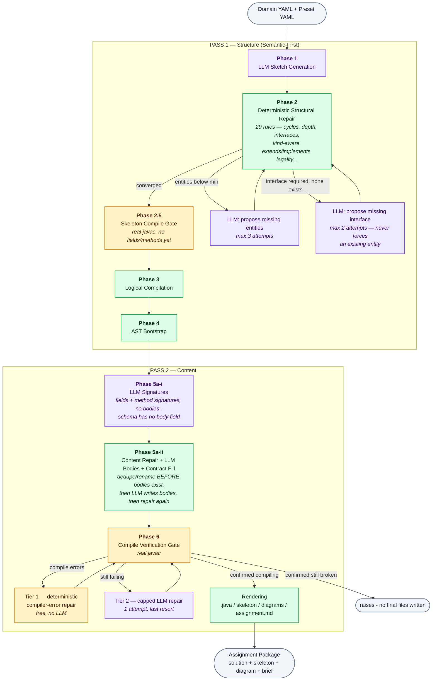

# OOP Assignment Generator

### Semantic-First, Deterministic-Repair Pipeline for Auto-Generating Java OOP Assignments

<p>
  
  
  
  
  
  
  <a href="LICENSE"></a>
</p>

> Published for portfolio and academic review. Publicly viewable, not open for reuse — see [`LICENSE`](LICENSE).

Generates a complete Java OOP programming assignment (class diagram, full reference solution, student skeleton, and assignment brief) from two inputs: a **domain** (topic + entity/relationship vocabulary) and a **blueprint preset** (difficulty — class count range, inheritance depth, which OOP features the design should include; note these are enforced unevenly — see row 11 of the epistemic table and limitation #10).

This README explains the reasoning behind the architecture, states plainly what has been verified vs. what hasn't — see [**Epistemic Status**](#-epistemic-status-proven-completeness-vs-evidence-only), which grades every area L1–L5 and marks exactly one as a completeness proof — and discloses every known limitation. Full mechanism-level detail (every rule, its exact trigger condition, and file:line) is in [`docs/pipeline-audit-v4-technical-report.md`](docs/pipeline-audit-v4-technical-report.md).

---

## 🧩 The Problem This Architecture Solves

A single LLM call asked to produce a complete, structurally-valid, pedagogically-correct OOP design in one shot has to satisfy two *categorically different* kinds of constraints at once:

- **Semantic constraints** — sensible entity names, relationships that make domain sense (`Customer` should own an `Account` more strongly than a `Bank` does).
- **Structural constraints** — exact class count range, no inheritance cycles, correct interface/abstract usage, valid Java visibility rules.

LLMs are strong at the first, unreliable at holding the second across a long generation. Forcing one call to do both produces a *systematic* failure mode, not a random one: the model trades correctness in one dimension for the other.

### Two architectures were considered

- **Structure-first**: code generates a valid graph shape (right count, right depth), LLM fills in names afterward. Risk: the LLM tends to *rationalize* a structure it didn't choose — inventing a plausible-sounding explanation for a nonsensical relationship (e.g. `Account inherits Transaction`) instead of flagging it as wrong. This failure is dangerous specifically because it *looks* intentional on review.
- **Semantic-first** (chosen): the LLM designs freely from the domain first; a deterministic repair layer fixes structural violations afterward, calling the LLM back only when *new content* is genuinely needed (never to "self-correct" its own structure).

**This isn't a theoretical preference — it was proven, not assumed.** A direct test forced an existing, meaningful entity (`Order`, holding `composes_with: [Product]` and `associated_with: [Payment]`) to become an interface to satisfy a missing-interface requirement. Because interfaces cannot hold state, the deterministic repair step correctly stripped both relationships — the result was a completely empty `public interface Order {}`, silently destroying the one entity that represented the whole point of the domain. It compiled fine. Nothing about it looked wrong to any automated check. That is the concrete, reproduced failure mode structure-first risks by construction, and it is why the reverse choice (interfaces only ever come from genuine LLM proposals, never from repurposing existing entities — see Phase 1.3 in the technical report) was made instead.

---

## 🏗️ Architecture: 7 Phases, 2 Passes

<sub>🟣 LLM call &nbsp;&nbsp; 🟢 deterministic code, no LLM &nbsp;&nbsp; 🟠 compile-verification gate</sub>



The governing principle, applied consistently across every phase: **the LLM owns meaning, deterministic code owns invariants it can verify with certainty, and the LLM is called back only when a gap requires genuinely new content — never to "please try to be more correct."**

Phase 6 is the newest and most important safety net: instead of hand-writing an ever-growing list of Python rules that each encode one more slice of the Java Language Specification, it runs the **real `javac` compiler** against the generated code and reacts to its actual error output. Known error shapes (missing import, private-field access from a subclass, invalid override, duplicate method, unfulfilled interface contract) are fixed deterministically, for free, with no LLM call. Anything unrecognized escalates to a single capped LLM repair attempt — a genuine last resort, not the primary correctness mechanism.

---

## ✅ Epistemic Status: Proven Completeness vs. Evidence Only

Every claim in this repo sits on one of five levels of backing. **The level matters more than the claim** — it is the answer to *how do you know*, not *does it work*. Nothing below is labeled higher than what was actually done.

| Level | Backing | What it licenses |
|---|---|---|
| **L1 — oracle exhaustion** | Every point of a *bounded* space enumerated, each label decided by a real oracle (`javac`), locked as a regression test | A genuine **completeness** claim. "Why this rule?" → an exit code |
| **L2 — spec derivation** | Rule derived from the JLS or a type constraint, not from the bug that happened to surface it | Correctness of that rule. Says nothing about the rule *set* being closed |
| **L3 — measurement, threshold pre-registered** | Live trials with the decision threshold fixed *before* running anything | A calibrated decision, valid **only inside the measured envelope** |
| **L4 — oracle sampling** | Fuzz / unit trials against real inputs | "We found bugs and closed them." **Not** "the rule set is closed" |
| **L5 — read-through** | Manual reasoning, no oracle available in this environment | Nothing verifiable. Labeled as such, never folded into the levels above |

The distinction that matters: **L1 answers "why exactly these N rules and not N+1". L4 cannot.** Most of this system is L4. That is stated here rather than blurred, because a rule set with no closure argument is one bug report away from becoming an ad-hoc patch pile, and knowing which areas are in that state is the whole point of the table.

### Area-by-area

| # | Area | Level | Completeness |
|---|---|---|---|
| 1 | `extends`/`implements` kind legality — 18 cells, (class\|abstract\|interface)² × 2 verbs | **L1** | ✅ **Proven.** Bounded space fully enumerated; every label derived by real `javac`, not hand-written; locked in `tests/test_skeleton_gate.py` (19 tests, skipped if no `javac`) |
| 2 | Final solution compiles | **L1** | ✅ **Proven per run** by Phase 6 + fail-closed `raise`. This is *verification of one output*, not completeness of the repair rules that produced it |
| 3 | Domain hint envelope (`MAX_ENTITY_HINTS = 8`) | **L3** | ✅ **Proven inside the measured envelope only** (ratio ≤ 2.0, 2 × 30 live trials), and the validator refuses anything outside it instead of extrapolating. The model case of honest scoping in this repo |
| 4 | Java identifier safety on all generated names | **L2** | 🟡 Complete over "is a legal Java identifier"; reserved keywords deliberately excluded (delegated to rule `4.6`) |
| 5 | Inheritance depth (`2.3`), max class count (`2.5`) | **L2 + L4** | 🟡 Hard-enforced deterministically and regression-tested — but no bounded-space argument, and `2.5` is never exercised by the fuzz tests (they run one permissive preset, `max_classes=10`) |
| 6 | Phase 2 output under fuzz | **L4** | 🟡 **L4 forever** (sampling an infinite graph space is L4 at trial 50 and at trial 500,000) — but now against the **real oracle** and with a *measured* coverage number instead of an adjective: `tests/test_repair_fuzz_javac.py` runs 5 configurations through the production path (`repair` → `compile_logical_plan` → `build_ast` → `render_class`) into real `javac`, and a probe confirms they exercise **24 of the 29 rule IDs**. Getting there meant fixing fixtures that masked their own rules (aggregation was enabled so `2.7` could never fire; every entity was `core` so `2.8`'s non-core branch could never fire) — the same root-cause class as a check that runs before the mutation it guards. The 5 that still never fire: `2.1d`, both `2.14` sweeps, and two `2.10c` branches. The 3 older `hypothesis` tests remain pure-Python-invariant only |
| 7 | Structural repair rule set as a whole — **29 rule IDs**, `2.0` → `2.16` | **L4** | ❌ Not proven. 35 unit tests + 3 property tests. No completeness claim exists for cycles / depth / count / kind-consistency / has-a-on-interface / dedupe as a *set* |
| 8 | Content repair rule set — 7 rule IDs, `4.0a` → `4.8` | **L4** | ❌ Not proven. 21 unit tests including 5 live-found-bug regressions. No bounded space claimed |
| 9 | Tier-1 compiler-error category vocabulary — **5 pattern sets** (`TIER1_KINDS`) | **L4** | ❌ Completeness not proven and **not provable** - `javac`'s message space is not ours to bound. What *is* finite now is **observation**: any error block matching none of the 5 sets is recorded as a first-class artifact (`CompileVerificationGate.novel_error_shapes`) and logged as `NOVEL javac shape`, so "no novel shape was seen across the declared matrix" is falsifiable instead of assumed. Shapes append to `output/novel_shapes_log.jsonl` across runs, so the baseline accumulates from ordinary use rather than from a sweep |
| 10 | Student skeleton compiles | **L1** | ✅ **Proven per run.** The skeleton is now held to the same oracle as the solution (`compile_sources`), fail-closed: a confirmed failure deletes the skeleton output and raises rather than shipping it. Previously not checked at all - the solution was verified and the artifact the student actually receives was not |
| 11 | Preset OOP feature presence (`interface`, `abstraction`, `composition`) | **L2** | 🟡 **Detection complete, repair not attempted.** Still no guarantee loop for `abstraction`/`composition`, and `interface` retries twice then gives up - but no longer silent: all 8 requirements are written to `output/conformance_report.json` with an explicit verdict, and `run_all.py` reads it and **exits non-zero**. Verdicts also append to `output/conformance_log.jsonl` across runs. Complete over the preset schema, which is itself a bounded list |
| 12 | Mermaid / Markdown rendering | **L5** | ❌ Not proven, and the stated reason was **wrong**: an oracle *is* available here (`node v24.18.0` is on this machine, so `@mermaid-js/mermaid-cli` would parse-verify the `.mmd` the way `javac` verifies the `.java`). The real blocker is an unmade install decision, not an absent tool. Until it is wired this stays a read-through of every branch against the `classDiagram` grammar — see limitation #7 |
| 13 | Behavioral correctness of method bodies | — | ❌ Not proven, deliberately. Human-owned by design — but the loop has no seam yet, see limitation #13 |
| 14 | Cost / latency at scale | — | 🟡 **One data point, not a measurement.** A clean `e_commerce` × `advanced` run made **4** LLM calls (sketch, design decisions, signatures, bodies) — not the 7–8 quoted elsewhere, which is the *ceiling* reached only when Phase 1b, Phase 1c, contract-fill and Tier 2 all fire. Nothing is instrumented, so this is one observed run rather than a distribution |
| 15 | Declared input space — 5 domains × 3 presets = 15 combinations | **L2** | ✅ **Closed by declaration** (`src/supported.py`) and machine-checked against disk so it cannot drift. This is the move that makes any preset-boundary claim finite at all; inputs outside it still run, and `run_all.py` states plainly that no verified claim covers them |

### What completeness is even *available* here

L1 needs a **bounded** space to exhaust. That is not a standard to aspire to — it is a precondition, and it is either present or absent for a given area. In this system exactly **three** bounded spaces exist:

1. **Kind × verb legality** — `{class, abstract, interface}² × {extends, implements}` = 18 cells. Finite, enumerated, done (row 1).
2. **The declared input space** — 5 domains × 3 presets = 15 combinations, closed by declaration in `src/supported.py` and machine-checked against disk (row 15).
3. **The preset requirement list** — a fixed schema of 8 checks, so *detecting* a violation is complete even though *repairing* one is not (row 11).

Everything else in this system is unbounded **by construction**: `javac`'s message space (not ours to define), the space of all sketch graphs (infinite), the space of all English behavioural specifications (infinite). For those areas L1 is **unavailable**, not merely unachieved — and no amount of additional fuzzing changes that, because sampling an infinite space is still L4 at trial 380 and at trial 380,000.

So the honest response to an unbounded area is not more effort in the same direction. It is three moves, all finite:

- **Declare the supported subset** so the claims that remain are scoped to something enumerable (row 15).
- **Make observation finite and falsifiable** — you cannot prove `javac`'s message space is covered, but you *can* count every message that matched nothing and surface it, which turns "we assume it is covered" into "no counterexample has been seen yet, and here is the counter that would prove otherwise" (row 9).
- **Label the level and stop.** L4 correctly labeled is not a failure; L4 presented as L1 is.

**A system with one completeness proof and thirteen honestly-labeled areas is finished. A system claiming fourteen is not.** `javac` itself has no completeness proof; neither does any compiler in production.

### The specific L1 and L3 results, in full

- **156 automated tests pass** (`pytest tests/ -q`), covering all 7 phases, including a reproduction of every real bug found — not just happy paths.
- **Live end-to-end run after every change in this pass** (`e_commerce` × `advanced`, real Gemini + real JDK): exit code 0, Phase 6 compiled on the first attempt with no deterministic repair needed, `[SKELETON_GATE] Student skeleton compiles cleanly`, all 9 conformance requirements satisfied, and all three output directories re-verified independently with `javac` (exit 0 each). `conformance_log.jsonl` was appended; `novel_shapes_log.jsonl` was correctly *not* created, since no unrecognised `javac` shape occurred. The failure branches (conformance exit 1, skeleton-gate refusal, novel-shape logging) are covered by unit tests but have not yet fired in a live run.
- **Live end-to-end runs across 5 domains** (banking, e-commerce, library, RPG, animal kingdom) and 3 presets, each verified by compiling the output with a real JDK (`javac` → exit 0), not "it ran without a Python exception."
- A curated real run is committed at [`examples/sample-run-ecommerce/`](examples/sample-run-ecommerce/), reproducible with `python run_all.py configs/domains/e_commerce.yaml configs/presets/advanced.yaml` given a `GEMINI_API_KEY`. **Scope note**: its *deliverables* are current and verified — all three Java directories (`java/`, `java_skeleton/`, `java_detailed/`) compile with real `javac` (exit 0), re-checked as of this commit. Its *intermediate debug artifacts* are not: the `phase*.json` files predate the Tầng 0 schema change (inheritance lived in `relationships` then, it lives on `SketchEntity.extends` now) and two later renames (`phase_e_java_ast.json` → `phase4_ast_bootstrap.json`, `phase4_detailed_ast.json` → `phase6_detailed_ast.json`), so they will not re-parse against today's `SketchPlan`. Verified that this is staleness in the committed snapshot only, not a live round-trip defect: today's repair output dumps and re-parses cleanly. They refresh on the next real run.
- **The 18-cell legality matrix (row 1) is the only completeness proof in this repo.** Every cell rendered and compiled with a real JDK to *derive* the LEGAL/ILLEGAL label, then locked as a permanent regression test.
- Multiple real, previously-shipped compile-breaking bugs were found by actually running `javac`, not by inspection — duplicate methods, unfulfilled interface contracts, invalid overrides, missing imports, private-field access across inheritance — each with a before/after exit code as evidence. See [`docs/pipeline-audit-v4-technical-report.md`](docs/pipeline-audit-v4-technical-report.md).
- An independent code-review pass plus **380 adversarial fuzz trials** (2 seeds, entity graphs including interfaces) round-tripped through real `javac` found and closed 5 further compile-breaking gaps, including one the initial fix itself introduced. **That was a development-time measurement, not a committed regression test** — those trials are not reproducible from this repo. It has since been replaced by standing coverage: `tests/test_repair_fuzz_javac.py` runs 110 generated graphs across 5 configurations through the production render path into real `javac` on every `pytest` run, and unlike the old one-off it generates interfaces, closes inheritance cycles, breaches `max_depth`, feeds dangling edge targets, and exercises **24 of the 29 rule IDs** (measured, see row 6). Fewer trials, but reproducible, permanent, and with a coverage number attached — and still L4, because sampling an infinite space cannot be anything else.
- **Two recurring root-cause classes** emerged from that work, each with a proven fix pattern — these are the framework-level results, worth more than any individual rule:
  1. *A validity check that runs **before** a later rule can still mutate the state it was supposed to guard.* A claim about the pipeline's temporal ontology, not about one bug. Closed by consolidating scattered mid-pipeline checks into **one order-independent sweep**, run once after every mutating rule is done (`repair_pipeline.py` rules `2.13`–`2.16`).
  2. *A fixed pattern/regex safety net whose vocabulary doesn't cover the real compiler's full message space for that error category.* A claim about vocabulary completeness against an oracle-defined finite space. Closed by cross-checking against the **actual set of `javac` message shapes** rather than reacting to whichever one a fuzzer surfaced first.

---

## ⚖️ Disclosed Limitations & Trade-offs

These were raised and confirmed explicitly during development, not discovered later and glossed over:

1. **The LLM fallback in Phase 6 (Tier 2) is not guaranteed to fix anything.** It is capped to a single attempt by design — a genuine last-resort safeguard, not a primary mechanism, because compiler-error-repair research shows syntax/name errors are fixed reliably by LLMs but logical errors are not (~45% success rate in published benchmarks). This was confirmed live: on one real run, the Tier 2 LLM call *failed* to fix a real compile error and introduced a new, unrelated one (a spurious method named identically to its own class). The **root cause** in that case was subsequently found and fixed permanently in Phase 7's rendering logic, not patched over in Phase 6, on the principle that Phase 6 is a safety net and permanent fixes belong upstream of it. What the system does when both tiers are exhausted changed after peer review flagged it (see below): it used to log the residual error and ship the broken files anyway with no signal any caller checked; it now refuses to write the final deliverables at all and raises instead - see the "Addressed After Peer Review" section.
2. **Semantic/domain-quality correctness is entirely out of scope for automated verification.** Whether a relationship is the *right* relationship (should `Customer` own `Account` more strongly than `Bank` does?), and whether generated method bodies are meaningfully correct rather than short stubs, is not something any rule in this system checks. This is a deliberate architectural boundary, proven unavoidable with the current approach (see the `Order`-emptied-out example above) — not an oversight.
3. **Generic unresolved-type resolution was deliberately never built as a general rule.** Only a fixed whitelist of common Java types (`BigDecimal`, `UUID`, `Optional`, etc.) is resolved deterministically; anything outside it falls through to the capped, unreliable Phase 6 Tier 2.
4. **Cost**: up to 7–8 LLM calls per generation now, versus 1 in the original single-call design (this is intentional — it's the direct cost of the correctness guarantees above — but has not been measured at scale).
5. **Coverage is not exhaustive by choice.** 5 domains × 3 presets = 15 possible combinations exist; roughly 8 were live-verified. Domains are open-ended (arbitrary new topics can always be added), so 100% coverage was explicitly decided against in favor of stopping once the marginal bug-discovery rate dropped — a disclosed trade-off, not a gap that was missed.
6. **The detailed (AST-level) class diagram still cannot distinguish composition from aggregation** — only the sketch-level diagram and the assignment brief were fixed to make that distinction, because they're the only two renderers still connected to the one data structure (`LogicalPlan`) where the distinction survives past the structural-bootstrap phase.
7. **`mermaid_builder.py`/`markdown_builder.py` (diagram/assignment rendering) were reviewed but not oracle-verified — and the reason previously given for that was false.** Every code branch was manually checked against Mermaid's `classDiagram` grammar and no bug was found, so this remains a careful read-through rather than a proof. What was wrong was the justification: this section used to claim "there is no real compiler for Mermaid/Markdown available in this environment". Checked directly - `node v24.18.0` is installed on this machine, so `@mermaid-js/mermaid-cli` (`mmdc`) is an available oracle that would reject a malformed `classDiagram` exactly as `javac` rejects malformed Java, and row 12 could be L1-per-run rather than L5. The actual blocker is an install decision nobody has made (`mmdc` pulls Chromium through Puppeteer, a few hundred MB), not an absent tool. Recorded as an unmade decision rather than an impossibility, because those are different claims and only one of them was true.

8. **The Tier-1 error-category set has no closure mechanism, and cannot have one — but it is no longer silent.** `javac`'s message space is not ours to bound, so no completeness proof over the 5 categories is available at any effort level. What was actually wrong before was different and fixable: `parse_errors` already classified an unmatched block as `{"kind": "unknown"}`, so the parser *knew* it had hit a shape outside its vocabulary — and `verify_and_repair` used that only as a **routing decision** (escalate the class to Tier 2), throwing the epistemic fact away. The single trace it left was Tier 2 firing slightly more often than usual, and Tier 2 is designed to be rare, so that is exactly where such a signal goes to die unnoticed. **Now**: every unmatched shape is recorded on `CompileVerificationGate.novel_error_shapes` (deduped by `novel_shape_signature`, which normalises line numbers) and logged as `NOVEL javac shape - ... the Tier-1 vocabulary may be incomplete`. That converts an unprovable completeness question into a countable, falsifiable one. **Still open**: nothing sweeps the declared 15-combination matrix to establish a baseline count, and category #6 is still added by a human reading the log — the detector makes that addition evidence-driven rather than bug-driven, which is the most this area admits.
9. **Closed: the student skeleton is now compile-gated.** Phase 6 verifies the *solution* AST; the skeleton is derived from it afterwards by body-stubbing, and until this was closed the artifact the student actually receives had no oracle behind it at all — the assumption being that stubbing can only ever make code *more* compilable. It now goes through `compile_sources()` (the same real `javac`, the same `True`/`False`/`None` tri-state), and a confirmed failure deletes the skeleton output and raises instead of shipping it. **Residual caveat**: this verifies each run's output, it does not prove the stubbing rules are correct in general — row 10 is L1-per-run, exactly like row 2, not a completeness proof of the stubbing logic.
10. **Preset OOP features are still enforced unevenly — but a violation is now detected, recorded, and acted on.** `max_classes` and `max_depth` are hard-enforced deterministically (rules `2.5`, `2.3`). `min_classes` and a required `interface` get retry loops that give up after 3 and 2 attempts. `abstraction` and `composition` have no guarantee loop at all — **that has not changed, and repair is not attempted**. What changed is the reporting: all 8 requirements now go to `output/conformance_report.json` with an explicit `satisfied` verdict, `[CONFORMANCE]` lines are printed per requirement, and `run_all.py` reads the file and **exits non-zero** when the preset was not met — so a run that violated the instructor's spec no longer exits looking identical to a clean one. Phase 2.5's skeleton legality gate feeds the same report and was also fixed to stop returning `True` when `javac` is simply absent (it returns `None` now — the same "we did not look is not a pass" distinction peer review had already forced at Phase 6, still present here until now). This was the same stdout-only-signal defect shape in three places; all three now terminate in a file a caller reads.
11. **"Tier" carries three unrelated meanings across this repo and its sibling.** In `mini-grader`, Tier 1/2/3 is *epistemic confidence about what student code is* (raw AST → JLS-elaborated → reflection ground truth). In `compile_gate.py`, Tier 1/2 is *cost and reliability of a repair mechanism* (free deterministic → capped LLM). The L1–L5 ladder above is *confidence that a rule is correct*. Three orthogonal axes, one word — which makes "why tier X?" unanswerable without first asking "tier in which sense?". Renaming `compile_gate`'s tiers to cost-based names, reserving "Tier" for the epistemic axis, is pending.
12. **Deliverable scope is narrower than "a usable assignment".** The package is diagram + reference solution + skeleton + brief. There is **no entry point** (no `main`, no driver, no runnable scenario or expected output for a student to check against) and **no test suite or machine-readable grading contract**, so nothing downstream — including the sibling `mini-grader` — can consume the result automatically. The grading contract is a deliberate omission (see #13); the missing driver is simply not built yet.
13. **Human-in-the-loop is the intended mechanism for behavioral specification, but has no seam in the code.** Per-method behavior — what `calculateDiscount(double percentage)` should actually compute, given the brief currently states only its signature — is deliberately left to the instructor rather than trusted to an unreviewed LLM body. That choice is consistent with limitation #2 and is the right one. What does not yet exist is anywhere for that instructor to stand: `output/` is `rmtree`'d on every run (`detail_pipeline.py`, step 3i) so edits to `assignment.md` do not survive a re-run; no marker distinguishes the heavy behavioral methods from auto-generated accessors, so the instructor must diff `java_skeleton/` against `java_detailed/` by hand to find their own work; `DomainConfig` — explicitly framed as the author-controlled input — has no slot for behavioral intent; and Phase 5a-ii commits LLM-written bodies *before* any human sees them, with no path to re-run the compile gate over a human edit afterwards. The seam that would close this reuses machinery that already exists: `method_signature()` and the `(class_name, method_name, tuple(param_types))` fill-map key are already the right identity for a per-signature override file that Phase 5a-ii consults before calling the LLM, emits drafts into, and — critically — still routes through Phase 6.

---

## 🟢 Found, Reproduced Live, Fixed — a Worked Example of the Audit Method

Applying the same fix-pattern taxonomy above (validity-check-timing gaps, incomplete pattern vocabulary) to `content_repair_pipeline.py` and `compile_gate.py` surfaced 5 more real bugs. Documented here with the fix rather than silently folded in, because the chain shows why "each rule is individually correct" doesn't imply "the system is correct" — and why the fix for #1 alone would have been wrong without #2:

1. **`content_repair_pipeline.py` rule 4.1 could delete the method that fulfills an interface contract.** It dropped any method colliding with an auto-generated field accessor by (name, arity) alone, never checking whether that method was the one satisfying an abstract/interface requirement. Live-reproduced: an interface requiring `getValue(): boolean`, implemented by a class whose own field happens to auto-generate a same-named accessor, had its explicit implementation silently deleted on repair's second pass. **Fix**: exempt any signature the class is actually required to provide (a new shared helper, also used by the contract-detection function itself, so both agree on one definition of "required").
2. **Fixing #1 alone would only have moved the bug.** `JavaBuilder` unconditionally generates a getter/setter for every private field, with no check for whether the class already declares an explicit method with that exact signature — so keeping the now-required method meant it rendered *alongside* its own field's auto-generated twin, a duplicate-method javac error, live-verified even when the two signatures matched exactly. **Fix**: accessor generation now defers to any existing explicit method with the same (name, arity).
3. **`compile_gate.py`'s Tier 1 `invalid_override` pattern only matched javac's `"cannot override"` message** (class-extends-class), never `"cannot implement"` (class-implements-interface) — a different message for the same error category. A return-type mismatch against an interface contract fell through Tier 1 unresolved and could cascade into 3 rounds of a `missing_override` fix piling up colliding stubs, shipping a file with duplicate methods that doesn't compile. **Fix**: the regex now matches both verbs — verified end-to-end live: Tier 1 now resolves the same scenario in one round.
4. **`JavaBuilder` silently dropped a has-a field on an interface** instead of rendering it for `javac` to reject — inconsistent with how `implements` on an interface source is already handled. Not reachable through the current `repair_pipeline.py` output path, but a real defense-in-depth gap. **Fix**: field rendering is no longer gated on `is_interface`, matching `implements`'s treatment.
5. **`compile_gate.py`'s `missing_override` fix only added one stub per Tier-1 round**, because javac only ever reports the *first* missing method per class at a time — a class missing methods across 4 interfaces exhausted the default 3-round cap and shipped a class still missing its 4th method, live-reproduced. Same "fix rate assumed to exceed defect count" shape as an earlier `repair_pipeline.py` bug (batch-dropping excess classes). **Fix**: batch-fills the *entire* remaining contract gap in one round (reusing `content_repair_pipeline.py`'s own required-contract computation) instead of raising the round cap — verified to converge in one round regardless of how many methods are missing.

6. **A config contradiction inside the declared supported matrix — found by reading a live run's repair log, not the code.** `configs/presets/advanced.yaml` shipped `aggregation: enabled: false`, while **all five** shipped domains list an aggregation hint. Every `advanced` run was therefore *guaranteed* to fire rule `2.7_aggregation_fallback` and retype those edges to composition — reproducible lossiness in the supported set, not bad luck (the live run above logged it twice, `retype: 2`). It also made aggregation the only feature in the whole difficulty progression to go `true` at intermediate and back to `false` at advanced; every other feature is monotonically non-decreasing (inheritance absent → depth 2 → depth 3; abstraction and interface absent → `false` → `true`), which is what identified it as an oversight rather than a pedagogical choice. **Fix**: enabled it. Verified by replaying the live run's untainted `phase1_sketch_plan.json` through repair with the corrected preset, zero API calls — repair now takes **no action at all** (all five lossiness counters zero, down from `retype: 2`), and `aggregation` moves from an optional check to a required one that is satisfied. Note this does not disturb the Phase 2.fb measurement below: `measure_lossiness.py` counts a run lossy on `invent_or_destroy`, and `2.7` is classified `retype`.

All 6 fixes independently verified live (real javac, before and after) and locked in with 8 new regression tests. The full Tier 1 pattern set (5 categories) has now been audited this way — each category's real trigger shapes (as reachable through this specific pipeline, not the full Java error space) enumerated and checked against real javac, not just read for plausibility.

---

## 🔍 Addressed After Peer Review

An external review of an earlier version of this README raised 5 points. Each was checked against the actual code before acting on it — 2 were confirmed real and fixed, 1 was confirmed real but its specific example didn't apply (verified live, root cause was somewhere else), 2 were based on misreading which function reads from which data structure. Documented here rather than only fixed silently:

1. **Confirmed, fixed: no rollback when Phase 6 (compile verification) fails.** `verify_and_repair()` returned only the AST, never a pass/fail signal — every downstream file (both diagrams, the final `.java` files, the student skeleton, `assignment.md`) got written unconditionally, even on a run where the gate had already logged "Compile verification FAILED... shipping best-effort output" to its own internal report and nowhere else. A generated assignment that doesn't compile is the worst possible outcome for a student. **Fix**: the gate now exposes `self.success` (`True`/`False`/`None` — `None` means never actually checked, e.g. no `javac` on `PATH`, deliberately distinct from a confirmed pass), and the pipeline now raises immediately on a confirmed `False` rather than proceeding — refusing to ship, not degrading silently.
2. **Confirmed real, but the specific example given didn't apply: Mermaid syntax fragility.** The review's example was `List<String>`-style generics colliding with Mermaid's HTML-tag parsing — checked live, `mermaid_builder.py` already uses the safe `List~T~` tilde syntax everywhere, not raw angle brackets, so that specific failure mode doesn't exist here. Digging into *why* it couldn't happen surfaced the real, related gap: `JavaField`/`JavaMethod`/`JavaParameter.name` (and the actual Phase 5a-i LLM response type, `SignatureMethod.name`) had **zero** identifier-safety validation, unlike `SketchEntity.name` (PascalCase-validated since Phase 1). **Fix**: same Java-identifier check added to all of them - deliberately not rejecting reserved keywords, since renaming those is `content_repair_pipeline.py`'s `4.6` rule's job, not this validator's.
3. **Fair point, no code was wrong: only 5 domains' worth of live evidence backs the `measure_lossiness.py`-driven prompt fix** (see the "Measured Before Building: Phase 2.fb" section below) - extrapolating to an arbitrary future domain (e.g. many more `entity_hints` against a much smaller `max_classes`) is genuinely untested. Rather than trying to prove the fix generalizes to an unbounded ratio (which would need spending real API calls against domains that don't exist yet), domain YAML was reframed for what it actually is here - an author-controlled asset, not adversarial input. **Fix**: `DomainConfig` now validates `entity_hints` stays within the actual measured envelope (ratio ≤ 2.0, i.e. `entity_hints` count ≤ 8 against the smallest shipped preset's `max_classes`=4) and raises a clear, actionable error if a future domain would exceed it - all 5 shipped domains already fit.
4. **Misread the code: claimed the detailed AST diagram and the sketch diagram read from two different "sources of truth"** (implying the pipeline isn't really using one consistent intermediate representation). Checked directly: `SemanticEntity` (the `LogicalPlan` IR) keeps `composes_with`/`aggregates_with` as two always-separate fields - nothing is lost there. `build_class_diagram(final_plan)` reads that IR directly (full fidelity); `build_detailed_diagram(ast_classes)` reads the *Java-compiled-down* representation, where the distinction is gone because **Java itself has no compile-time way to express it** (composition vs. aggregation is a UML-level distinction, not a Java-language one - the same way `javac` itself discards local variable names by default). One IR, one deliberate lossy compilation step, two renderers correctly reading from whichever stage existed when they run - not two sources of truth.
5. **Not a new finding: "semantic-first" doesn't mean semantic-*verified*.** The review treated "the system can't check whether `Customer extends ShoppingCart` makes domain sense" as a contradiction of the architecture's name. "Semantic-first" describes *division of labor and order of operations* (the LLM designs freely before any mechanical check runs) - it was never a claim that semantic correctness gets verified, and the README already disclosed this boundary explicitly with a reproduced example (the `Order`-emptied-out case above) before this review happened.

---

## 📏 Measured Before Building: Phase 2.fb

An earlier idea was floated for a "Phase 2.fb" — a constraint-aware LLM retry triggered whenever Phase 2's repair destroys or invents structure the LLM didn't propose (e.g. deleting an entity to satisfy a class-count limit). Instead of assuming it was needed, a cheap harness (`measure_lossiness.py` — runs only Phase 1→2→2.5, never the expensive Phase 5a/6 body-writing calls) measured it against real domains, with the decision threshold **pre-registered before running anything**: <15% of runs showing destructive repair → skip it, >35% → build it, in between → a genuine judgment call.

First real run (30 trials, 5 domains × 3 presets): **20%** — the ambiguous zone. Breaking the causes down showed 5 of 6 lossy runs shared one root cause: `2.5_excess_classes` deleting an entity, concentrated on low-`max_classes` presets whose domain `entity_hints` listed more candidates than the limit allowed — `generate_sketch`'s prompt called structural guidance "soft, don't worry about precision" while separately *requiring* novel entities on top of the hints, actively pushing counts above whatever `max_classes` an instructor's preset configured (presets are instructor-editable templates, so the fix had to generalize to any limit, not just the shipped ones).

Fixed with a prompt change alone — 0 extra LLM calls: state the class-count limit as a hard constraint with the actual hint count computed and shown, and reframe "invent novel entities" as *replacing* a weak hint rather than adding to the total. Re-ran the identical 30-trial measurement: **20% → 6.7%**, now below the pre-registered 15% line. **Decision: Phase 2.fb was not built** — a cheap, general fix resolved the concentrated cause; building a whole new LLM-retry mechanism for a problem this narrow would have been the wrong trade.

---

## 🚀 Running It

```bash
pip install -r requirements.txt
# create a .env file with GEMINI_API_KEY=...
python run_all.py configs/domains/<domain>.yaml configs/presets/<preset>.yaml
```

Outputs land in `output/` (gitignored, regenerated every run — see `examples/` for a fixed reference run), including `conformance_report.json` (the machine-readable verdict on every preset requirement) plus two append-only baselines that accumulate across runs: `conformance_log.jsonl` and `novel_shapes_log.jsonl`.

`run_all.py` **exits non-zero** when the generated assignment does not satisfy the preset, and refuses to write the final package at all if either compile gate (solution or skeleton) confirms a failure. A clean exit means: it compiled, the skeleton compiled, and every preset requirement was met.

```bash
pytest tests/ -q   # 156 tests
```

## 📁 Repo Layout

```
src/pipeline.py                    Phase 1-3 orchestration, incl. Phase 2.5 skeleton gate
src/validator/repair_pipeline.py   Phase 2 - deterministic structural repair (29 rules,
                                    kind-aware inheritance schema, whitelist-by-construction)
src/validator/skeleton_gate.py     Phase 2.5 - real-javac structural legality gate
src/validator/content_repair_pipeline.py  Phase 5a-ii - deterministic content repair + contract fulfillment
src/validator/compile_gate.py      Phase 6 - real-javac compile verification gate,
                                    plus compile_sources() (skeleton gate) and the
                                    novel-error-shape detector
src/detail_pipeline.py             Phase 5a-7 orchestration, incl. the skeleton compile gate
src/supported.py                   The declared, finite input matrix (5 domains x 3 presets)
src/builders/                      Phase 4/7 - AST, Mermaid diagram, and assignment.md rendering
src/llm/gemini.py                  All LLM-facing prompts and structured-output contracts
configs/domains/, configs/presets/ Domain vocabulary and difficulty blueprints
tests/                             156 tests, including reproductions of every real bug found
docs/pipeline-audit-v4-technical-report.md   Full rule-by-rule technical reference
examples/sample-run-ecommerce/     A real, javac-verified run, committed as a static artifact
                                    (deliverables current; phase*.json debug files predate
                                    the Tang 0 schema change - see the scope note above)
```
