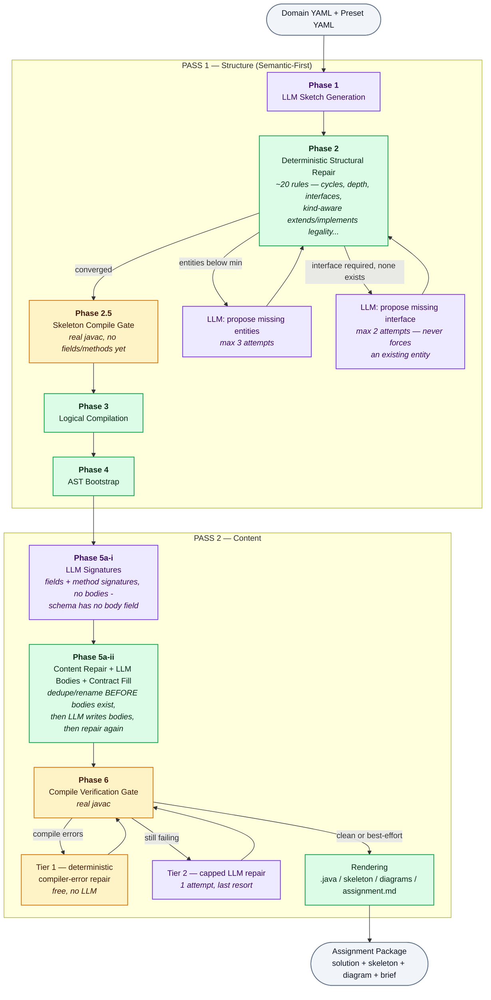

# OOP Assignment Generator

### Semantic-First, Deterministic-Repair Pipeline for Auto-Generating Java OOP Assignments

<p>
  
  
  
  
  
  
  <a href="LICENSE"></a>
</p>

> Published for portfolio and academic review. Publicly viewable, not open for reuse — see [`LICENSE`](LICENSE).

Generates a complete Java OOP programming assignment (class diagram, full reference solution, student skeleton, and assignment brief) from two inputs: a **domain** (topic + entity/relationship vocabulary) and a **blueprint preset** (difficulty — class count range, inheritance depth, which OOP features must appear).

This README explains the reasoning behind the architecture, states plainly what has been verified vs. what hasn't, and discloses every known limitation. Full mechanism-level detail (every rule, its exact trigger condition, and file:line) is in [`docs/pipeline-audit-v4-technical-report.md`](docs/pipeline-audit-v4-technical-report.md).

---

## 🧩 The Problem This Architecture Solves

A single LLM call asked to produce a complete, structurally-valid, pedagogically-correct OOP design in one shot has to satisfy two *categorically different* kinds of constraints at once:

- **Semantic constraints** — sensible entity names, relationships that make domain sense (`Customer` should own an `Account` more strongly than a `Bank` does).
- **Structural constraints** — exact class count range, no inheritance cycles, correct interface/abstract usage, valid Java visibility rules.

LLMs are strong at the first, unreliable at holding the second across a long generation. Forcing one call to do both produces a *systematic* failure mode, not a random one: the model trades correctness in one dimension for the other.

### Two architectures were considered

- **Structure-first**: code generates a valid graph shape (right count, right depth), LLM fills in names afterward. Risk: the LLM tends to *rationalize* a structure it didn't choose — inventing a plausible-sounding explanation for a nonsensical relationship (e.g. `Account inherits Transaction`) instead of flagging it as wrong. This failure is dangerous specifically because it *looks* intentional on review.
- **Semantic-first** (chosen): the LLM designs freely from the domain first; a deterministic repair layer fixes structural violations afterward, calling the LLM back only when *new content* is genuinely needed (never to "self-correct" its own structure).

**This isn't a theoretical preference — it was proven, not assumed.** A direct test forced an existing, meaningful entity (`Order`, holding `composes_with: [Product]` and `associated_with: [Payment]`) to become an interface to satisfy a missing-interface requirement. Because interfaces cannot hold state, the deterministic repair step correctly stripped both relationships — the result was a completely empty `public interface Order {}`, silently destroying the one entity that represented the whole point of the domain. It compiled fine. Nothing about it looked wrong to any automated check. That is the concrete, reproduced failure mode structure-first risks by construction, and it is why the reverse choice (interfaces only ever come from genuine LLM proposals, never from repurposing existing entities — see Phase 1.3 in the technical report) was made instead.

---

## 🏗️ Architecture: 7 Phases, 2 Passes

<sub>🟣 LLM call &nbsp;&nbsp; 🟢 deterministic code, no LLM &nbsp;&nbsp; 🟠 compile-verification gate</sub>



The governing principle, applied consistently across every phase: **the LLM owns meaning, deterministic code owns invariants it can verify with certainty, and the LLM is called back only when a gap requires genuinely new content — never to "please try to be more correct."**

Phase 6 is the newest and most important safety net: instead of hand-writing an ever-growing list of Python rules that each encode one more slice of the Java Language Specification, it runs the **real `javac` compiler** against the generated code and reacts to its actual error output. Known error shapes (missing import, private-field access from a subclass, invalid override, duplicate method, unfulfilled interface contract) are fixed deterministically, for free, with no LLM call. Anything unrecognized escalates to a single capped LLM repair attempt — a genuine last resort, not the primary correctness mechanism.

---

## ✅ What Is Actually Proven (Not Claimed)

Every claim below was verified this session, not assumed:

- **67 automated tests pass** (`pytest tests/ -q`), covering all 7 phases, including reproductions of every real bug found (not just happy-path cases).
- **Live end-to-end runs across 5 domains** (banking, e-commerce, library, RPG, animal kingdom) and 3 difficulty presets, each verified by compiling the generated output with a real JDK (`javac ... ` → exit code 0), not just "it ran without a Python exception."
- A curated real run is committed at [`examples/sample-run-ecommerce/`](examples/sample-run-ecommerce/) — full solution, skeleton, diagrams, and assignment brief, reproducible with `python run_all.py configs/domains/e_commerce.yaml configs/presets/advanced.yaml` given a `GEMINI_API_KEY`.
- Multiple real, previously-shipped compile-breaking bugs were found by actually running `javac` against generated output (not by inspection) — duplicate methods, unfulfilled interface contracts, invalid overrides, missing imports, private-field access across inheritance — each with a before/after `javac` exit code as evidence. Details and root causes: [`docs/pipeline-audit-v4-technical-report.md`](docs/pipeline-audit-v4-technical-report.md).
- **Phase 2's extends/implements legality is proven, not spot-checked**: every (class/abstract/interface) × (class/abstract/interface) combination for both `extends` and `implements` — 18 cells total — was rendered and compiled with a real JDK to derive the LEGAL/ILLEGAL label (not hand-written), then locked as a permanent regression test (`tests/test_skeleton_gate.py`). An independent code-review pass plus 380 further adversarial fuzz trials (2 random seeds, entity graphs including interfaces) round-tripped through real `javac` found and closed 5 more compile-breaking gaps the initial fix missed, including a bug the fix itself introduced. Two recurring root-cause classes emerged from that work, both with a proven fix pattern: (1) a validity check running *before* a later rule can still mutate the state it's supposed to guard — closed by consolidating scattered mid-pipeline checks into one order-independent sweep, run once after every mutating rule is done (`repair_pipeline.py` rules `2.13`-`2.16`); (2) a fixed pattern/regex safety net whose vocabulary doesn't cover the real compiler's full message space for that error category — closed by cross-checking against the actual finite set of `javac` message shapes rather than reacting to whichever one a fuzzer happens to surface first.

---

## ⚖️ Disclosed Limitations & Trade-offs

These were raised and confirmed explicitly during development, not discovered later and glossed over:

1. **The LLM fallback in Phase 6 (Tier 2) is not guaranteed to fix anything.** It is capped to a single attempt by design — a genuine last-resort safeguard, not a primary mechanism, because compiler-error-repair research shows syntax/name errors are fixed reliably by LLMs but logical errors are not (~45% success rate in published benchmarks). This was confirmed live: on one real run, the Tier 2 LLM call *failed* to fix a real compile error and introduced a new, unrelated one (a spurious method named identically to its own class). The system did not crash or silently ship broken output — it logged the residual compiler error and shipped best-effort — but the fix itself was not reliable. The **root cause** in that case was subsequently found and fixed permanently in Phase 7's rendering logic, not patched over in Phase 6, on the principle that Phase 6 is a safety net and permanent fixes belong upstream of it.
2. **Semantic/domain-quality correctness is entirely out of scope for automated verification.** Whether a relationship is the *right* relationship (should `Customer` own `Account` more strongly than `Bank` does?), and whether generated method bodies are meaningfully correct rather than short stubs, is not something any rule in this system checks. This is a deliberate architectural boundary, proven unavoidable with the current approach (see the `Order`-emptied-out example above) — not an oversight.
3. **Generic unresolved-type resolution was deliberately never built as a general rule.** Only a fixed whitelist of common Java types (`BigDecimal`, `UUID`, `Optional`, etc.) is resolved deterministically; anything outside it falls through to the capped, unreliable Phase 6 Tier 2.
4. **Cost**: up to 7–8 LLM calls per generation now, versus 1 in the original single-call design (this is intentional — it's the direct cost of the correctness guarantees above — but has not been measured at scale).
5. **Coverage is not exhaustive by choice.** 5 domains × 3 presets = 15 possible combinations exist; roughly 8 were live-verified. Domains are open-ended (arbitrary new topics can always be added), so 100% coverage was explicitly decided against in favor of stopping once the marginal bug-discovery rate dropped — a disclosed trade-off, not a gap that was missed.
6. **The detailed (AST-level) class diagram still cannot distinguish composition from aggregation** — only the sketch-level diagram and the assignment brief were fixed to make that distinction, because they're the only two renderers still connected to the one data structure (`LogicalPlan`) where the distinction survives past the structural-bootstrap phase.

---

## 🔴 Known Issues — Found, Confirmed, Not Yet Fixed

Applying the same fix-pattern taxonomy above (validity-check-timing gaps, incomplete pattern vocabulary) to `content_repair_pipeline.py` and `compile_gate.py` surfaced 3 more confirmed bugs. Disclosed here rather than silently fixed-and-forgotten or omitted, per this README's own stated standard:

1. **`content_repair_pipeline.py` rule 4.1 can delete the method that fulfills an interface contract.** 4.1 drops any method colliding with an auto-generated field accessor by (name, arity) alone — it doesn't check whether that method is the one satisfying an abstract/interface requirement. Live-reproduced: an interface requiring `getValue(): boolean`, implemented by a class whose own field happens to auto-generate a same-named accessor, has its explicit implementation silently deleted on repair's second pass.
2. **That bug can cascade into genuinely broken, non-compiling shipped output.** When the field's auto-accessor return type does *not* match the contract's required type, `compile_gate.py`'s Tier 1 `missing_override` fix re-adds a stub without checking for the resulting collision, and its `invalid_override` regex only matches `"cannot override"` (class-extends-class) — never `"cannot implement"` (class-implements-interface), a *different* message javac uses for the same category of error. Reproduced live: 3 Tier-1 rounds each add one more colliding method, and the pipeline ships a `Child.java` with 3 duplicate `getValue()` declarations plus a return-type mismatch — a file that does not compile, reported as "shipping best-effort output."
3. **`JavaBuilder.render_class` silently drops a has-a field on an interface instead of rendering it for `javac` to reject.** Interfaces cannot hold private mutable state — `repair_pipeline.py` already strips this before rendering, so it isn't reachable through the current pipeline path — but the renderer itself doesn't enforce it, unlike `implements` (deliberately rendered even when invalid, so the compiler catches it instead of the data disappearing unexplained). An inconsistent application of "let the compiler be the oracle," not a live failure today.

Fix plan (not yet applied): (1) exempt contract-required signatures from 4.1's collision check; (2) extend `invalid_override`'s regex to also match `"cannot implement"`; (3) render has-a fields on interfaces unconditionally, matching `implements`'s treatment.

---

## 🚀 Running It

```bash
pip install -r requirements.txt
# create a .env file with GEMINI_API_KEY=...
python run_all.py configs/domains/<domain>.yaml configs/presets/<preset>.yaml
```

Outputs land in `output/` (gitignored, regenerated every run — see `examples/` for a fixed reference run).

```bash
pytest tests/ -q   # 104 tests
```

## 📁 Repo Layout

```
src/pipeline.py                    Phase 1-3 orchestration, incl. Phase 2.5 skeleton gate
src/validator/repair_pipeline.py   Phase 2 - deterministic structural repair (~20 rules,
                                    kind-aware inheritance schema, whitelist-by-construction)
src/validator/skeleton_gate.py     Phase 2.5 - real-javac structural legality gate
src/validator/content_repair_pipeline.py  Phase 5a-ii - deterministic content repair + contract fulfillment
src/validator/compile_gate.py      Phase 6 - real-javac compile verification gate
src/detail_pipeline.py             Phase 5a-7 orchestration
src/builders/                      Phase 4/7 - AST, Mermaid diagram, and assignment.md rendering
src/llm/gemini.py                  All LLM-facing prompts and structured-output contracts
configs/domains/, configs/presets/ Domain vocabulary and difficulty blueprints
tests/                             104 tests, including reproductions of every real bug found
docs/pipeline-audit-v4-technical-report.md   Full rule-by-rule technical reference
examples/sample-run-ecommerce/     A real, javac-verified run, committed as a static artifact
```
