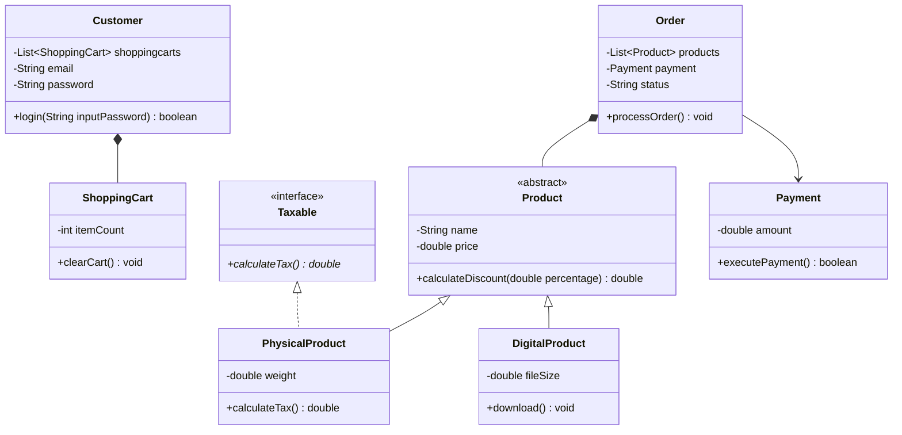

# Object-Oriented Programming Assignment: E-Commerce Platform

A platform for online shopping, managing products, shopping carts, and customer orders.


## 1. Class Diagram
Please implement the system exactly as shown in this diagram:



## 2. Constraints
- Min Classes: 5
- Max Classes: 8
- Inheritance Depth: 3
- Must include at least one abstract class
- Must include at least one interface
- Must use composition between classes

## 3. Design Decisions
- Modeled a flexible e-commerce platform featuring an abstract Product base class to represent any sellable entity in the catalog.
- Created specialized concrete products like PhysicalProduct and DigitalProduct inheriting from the Product base class.
- Introduced a Taxable interface to define behavior for tax-applicable items, with PhysicalProduct implementing this interface.
- Established a composition relationship between Customer and ShoppingCart, indicating that the customer owns and manages a cart.
- Created an Order entity composed of products and associated with a Payment record to handle the final purchase contract and transaction flow.
- Marked Product as abstract through structural derivation because it acts as a base class with multiple concrete implementations.
- Marked Taxable as an interface based on semantic signals and its role as an implementation target for concrete products.

## 4. Student Skeletons
Use the following skeleton code as a starting point. Fill in the missing implementations:

### Product.java
```java
public abstract class Product {
    private String name;
    private double price;

    protected Product(String name, double price) {
        this.name = name;
        this.price = price;
    }

    public String getName() {
        return this.name;
    }
    public void setName(String name) {
        this.name = name;
    }
    public double getPrice() {
        return this.price;
    }
    public void setPrice(double price) {
        this.price = price;
    }

    public double calculateDiscount(double percentage) {
        return 0;
    }
}
```

### PhysicalProduct.java
```java
public class PhysicalProduct extends Product implements Taxable {
    private double weight;

    public PhysicalProduct(String name, double price, double weight) {
        super(name, price);
        this.weight = weight;
    }

    public double getWeight() {
        return this.weight;
    }
    public void setWeight(double weight) {
        this.weight = weight;
    }

    public double calculateTax() {
        return 0;
    }
}
```

### DigitalProduct.java
```java
public class DigitalProduct extends Product {
    private double fileSize;

    public DigitalProduct(String name, double price, double fileSize) {
        super(name, price);
        this.fileSize = fileSize;
    }

    public double getFileSize() {
        return this.fileSize;
    }
    public void setFileSize(double fileSize) {
        this.fileSize = fileSize;
    }

    public void download() {
    }
}
```

### Customer.java
```java
import java.util.ArrayList;
import java.util.List;

public class Customer {
    private List<ShoppingCart> shoppingcarts;
    private String email;
    private String password;

    public Customer(List<ShoppingCart> shoppingcarts, String email, String password) {
        this.shoppingcarts = shoppingcarts;
        this.email = email;
        this.password = password;
    }

    public List<ShoppingCart> getShoppingcarts() {
        return this.shoppingcarts;
    }
    public void setShoppingcarts(List<ShoppingCart> shoppingcarts) {
        this.shoppingcarts = shoppingcarts;
    }
    public String getEmail() {
        return this.email;
    }
    public void setEmail(String email) {
        this.email = email;
    }
    public String getPassword() {
        return this.password;
    }
    public void setPassword(String password) {
        this.password = password;
    }

    public boolean login(String inputPassword) {
        return false;
    }
}
```

### ShoppingCart.java
```java
public class ShoppingCart {
    private int itemCount;

    public ShoppingCart(int itemCount) {
        this.itemCount = itemCount;
    }

    public int getItemCount() {
        return this.itemCount;
    }
    public void setItemCount(int itemCount) {
        this.itemCount = itemCount;
    }

    public void clearCart() {
    }
}
```

### Order.java
```java
import java.util.ArrayList;
import java.util.List;

public class Order {
    private List<Product> products;
    private Payment payment;
    private String status;

    public Order(List<Product> products, Payment payment, String status) {
        this.products = products;
        this.payment = payment;
        this.status = status;
    }

    public List<Product> getProducts() {
        return this.products;
    }
    public void setProducts(List<Product> products) {
        this.products = products;
    }
    public Payment getPayment() {
        return this.payment;
    }
    public void setPayment(Payment payment) {
        this.payment = payment;
    }
    public String getStatus() {
        return this.status;
    }
    public void setStatus(String status) {
        this.status = status;
    }

    public void processOrder() {
    }
}
```

### Taxable.java
```java
public interface Taxable {
    public double calculateTax();
}
```

### Payment.java
```java
public class Payment {
    private double amount;

    public Payment(double amount) {
        this.amount = amount;
    }

    public double getAmount() {
        return this.amount;
    }
    public void setAmount(double amount) {
        this.amount = amount;
    }

    public boolean executePayment() {
        return false;
    }
}
```
